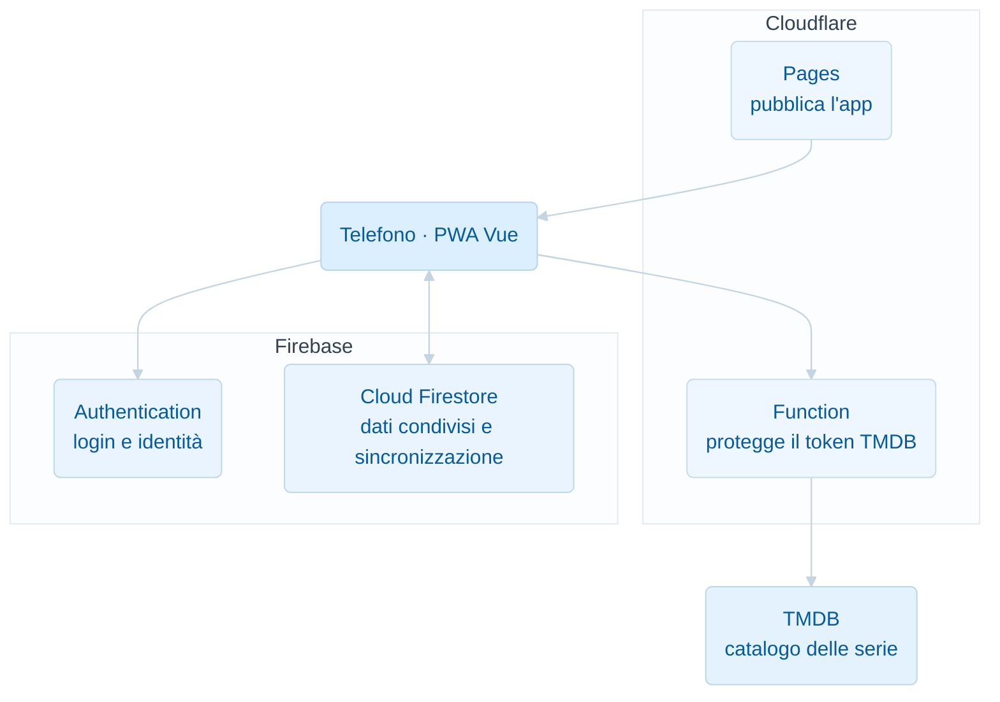

# Architettura di TV Tracker

TV Tracker è una PWA mobile-first per tracciare una lista condivisa di serie TV. L'applicazione viene eseguita sul telefono, mentre Cloudflare distribuisce il frontend e protegge l'accesso a TMDB; Firebase autentica gli utenti e sincronizza i dati condivisi.

## Schema generale

## Componenti

### Applicazione

| Componente | Scopo |
| --- | --- |
| **Vue 3** | Gestisce interfaccia, navigazione e logica applicativa nel browser. |
| **Vite** | Avvia l'ambiente di sviluppo e produce i file statici per la pubblicazione. |
| **PWA e service worker** | Rendono l'app installabile, gestiscono la cache e segnalano gli aggiornamenti disponibili. |

### Cloudflare

| Componente | Scopo |
| --- | --- |
| **Pages** | Ospita e distribuisce frontend, stili, icone e service worker. |
| **Function** | Inoltra le richieste a TMDB senza esporre il token segreto nel browser. |

### Firebase

| Componente | Scopo |
| --- | --- |
| **Authentication** | Verifica le credenziali e identifica Fabio o Irene. |
| **Cloud Firestore** | Conserva serie, avanzamenti ed eventi e li sincronizza tra i dispositivi. |
| **Regole Firestore** | Autorizzano l'accesso ai dati in base all'identità autenticata. |

### Catalogo e persistenza locale

| Componente | Scopo |
| --- | --- |
| **TMDB** | Fornisce titoli, locandine, stagioni, episodi, date e piattaforme. |
| **Dexie e IndexedDB** | Conservano i dati sul dispositivo quando viene attivata la modalità locale alternativa. |

## Responsabilità delle piattaforme

### Cloudflare

Cloudflare svolge due compiti distinti:

- **Pages** pubblica il frontend statico dell'applicazione;
- **Function** protegge il token TMDB e funge da intermediario tra app e catalogo.

Cloudflare non conserva i dati delle serie seguite: questi appartengono a Firestore.

### Firebase

Firebase comprende due servizi utilizzati insieme:

- **Authentication** stabilisce chi sta operando;
- **Cloud Firestore** conserva e sincronizza i dati condivisi.

La configurazione Firebase inclusa nel frontend non è un segreto. La sicurezza dipende dall'autenticazione e dalle regole Firestore.

### Applicazione sul dispositivo

Il browser esegue l'app Vue. Il service worker permette di avviarla come PWA e conserva in cache le risorse applicative. Quando la rete è disponibile, l'app comunica con Firebase per i dati condivisi e con la Cloudflare Function per consultare TMDB.

## Flusso essenziale

1. Cloudflare Pages distribuisce la PWA al dispositivo.
2. Firebase Authentication riconosce Fabio o Irene.
3. Cloud Firestore invia la lista condivisa e notifica le modifiche in tempo reale.
4. Per cercare o aggiornare una serie, l'app interroga la Cloudflare Function.
5. La Function consulta TMDB usando il token custodito su Cloudflare.
6. L'app salva in Firestore gli aggiornamenti e gli avanzamenti confermati.

## Modalità locale alternativa

Il progetto conserva anche una modalità locale esplicita. In questa configurazione:

- il controllo delle credenziali avviene localmente;
- i dati vengono salvati tramite Dexie in IndexedDB;
- non esiste sincronizzazione tra dispositivi.

La modalità locale e quella Firebase sono alternative: non scrivono contemporaneamente negli stessi dati.
