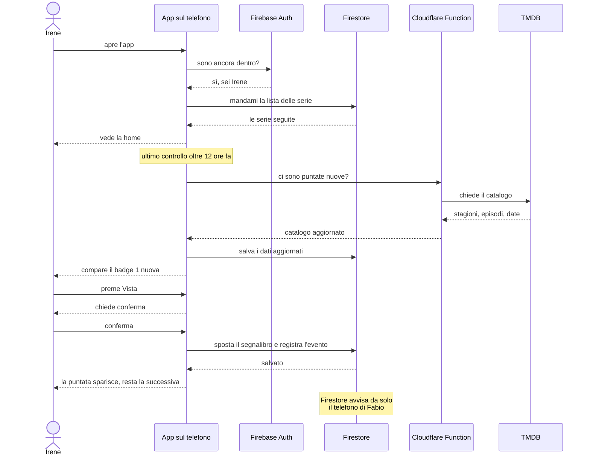

# 01 — Un telefono, il giro completo

Un solo telefono, una sera qualunque. Dall'apertura dell'app alla puntata segnata come vista, passando per tutti i pezzi dell'applicazione nell'ordine in cui entrano in gioco.

## Gli stessi passi, a parole

1. **Apre l'app.** È installata sul telefono: si avvia dal service worker, senza aspettare la rete.
2. **Non rifà il login.** Firebase Authentication si ricorda di lei.
3. **Vede la lista.** Arriva da Firestore, che ne tiene anche una copia sul telefono: se non c'è rete, la lista si vede lo stesso.
4. **L'app controlla da sola** se ci sono puntate nuove, ma solo se l'ultimo controllo è più vecchio di 12 ore.
5. **Non parla mai con TMDB direttamente.** Chiede alla Function di Cloudflare, che è l'unica a conoscere la chiave.
6. **Preme «Vista» e conferma.** La conferma c'è sempre: è la sola difesa contro il tocco per sbaglio.
7. **Firestore salva insieme** il segnalibro e l'evento — chi, quando, quale puntata. O si salvano entrambi, o nessuno dei due.
8. **Fabio non fa niente** e la sua home si aggiorna: l'avviso parte da Firestore, non dal telefono di Irene.

## A cosa serve ciascun pezzo

| Pezzo | Dove gira | A cosa serve | Quando entra |
| --- | --- | --- | --- |
| **Vue 3 + Vite** | nel browser | l'app vera e propria: schermate, pulsanti, logica | Fase 2 |
| **PWA (service worker)** | nel browser | installarla sul telefono e farla funzionare senza rete | Fase 17 |
| **IndexedDB + Dexie** | nel browser, sul telefono | tiene i dati **su quel dispositivo**. Niente rete, niente account | Fase 7 |
| **TMDB** | server pubblico | l'archivio: titoli, copertine, stagioni, episodi, date, piattaforme | Fase 10 |
| **Proxy di sviluppo (Vite)** | sul PC, durante lo sviluppo | custodisce la chiave TMDB mentre si lavora | Fase 10 |
| **Cloudflare Pages** | server | ospita l'app pubblicata | dopo la Fase 24 |
| **Cloudflare Function** | server | custodisce la chiave TMDB in produzione | Fase 10 |
| **Firebase Authentication** | server Google | verifica davvero utente e password | Fase 21 |
| **Cloud Firestore** | server Google | il database condiviso: fa vedere a Irene ciò che segna Fabio | Fase 22 |

## Lo stesso giro, prima che arrivi Firebase

Fino alla Fase 22 il disegno è identico, con due sostituzioni: al posto di **Firebase Auth** c'è il controllo della password in locale, e al posto di **Firestore** c'è IndexedDB sul telefono. Cambia una cosa sola, ed è l'ultima riga: **nessuno avvisa Fabio**, perché la lista vive su un dispositivo solo.
