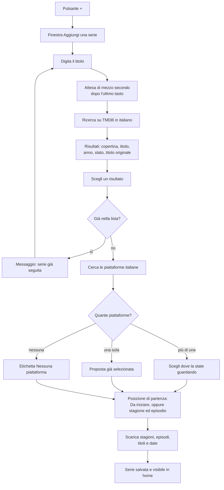
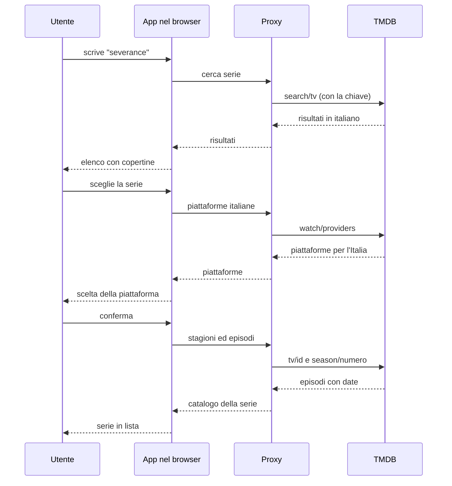

# 03 — Aggiunta di una serie

Il flusso più lungo dell'app. Si svolge in una finestra modale, come nel mockup. Una serie **non si aggiunge mai come testo libero**: solo scegliendo un risultato del catalogo.

**Note**

- Il duplicato si riconosce dall'**identificativo TMDB**, non dal titolo: due serie diverse possono chiamarsi uguale.
- Il titolo originale compare **solo qui**, in piccolo, per distinguere remake e omonimi. In home si vede il titolo italiano.
- Senza piattaforme italiane la serie **si aggiunge lo stesso**: la piattaforma ricorda dove guardare, non decide se una puntata esiste.
- La piattaforma è modificabile in seguito senza toccare episodi o posizione.

## Le tre chiamate a TMDB

La chiave non passa mai dal browser: l'app parla con il proxy, il proxy parla con TMDB.

