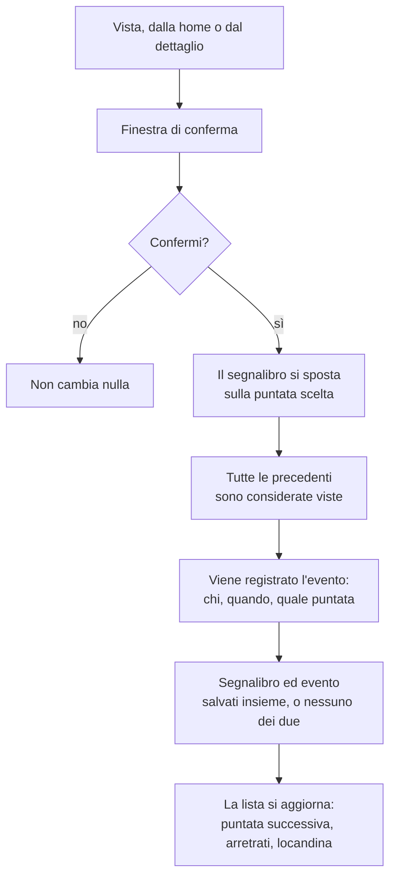
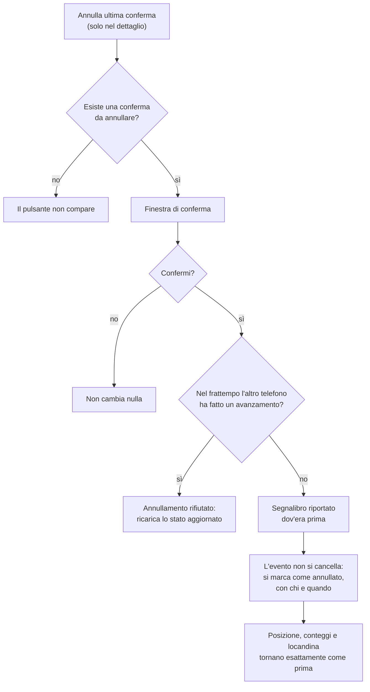

# 04 — Avanzamento e annullamento

Il cuore dell'app. L'idea di fondo: **non si tiene una spunta per ogni puntata**, si tiene un solo segnalibro — «siamo arrivati a S2E4» — e tutto il resto si deduce.

## Segnare una puntata come vista

**Note**

- La conferma è **sempre** richiesta, da entrambe le schermate. È l'unica protezione contro il tocco involontario.
- Scegliendo direttamente una puntata avanzata, **sparisce tutto quello che viene prima**, stagioni intere comprese. È voluto: serve a chi inizia a tracciare una serie già vista a metà.
- La locandina mostrata è quella della stagione della **prima puntata da vedere**: cambia da sola quando si passa alla stagione successiva.
- Le puntate future non si possono segnare: non sono ancora uscite.
- Segnalibro ed evento si salvano **in un'unica operazione**. Se fallisce, fallisce tutto: mai un segnalibro spostato senza il suo evento.

## Annullare l'ultima conferma

**Note**

- L'annullamento agisce **sull'ultima conferma della serie corrente**, non sulle altre serie.
- È l'**unico** modo di tornare indietro. Negli altri casi il segnalibro va solo avanti: così un telefono rimasto indietro non può far ricomparire puntate già viste.
- Il controllo «l'altro telefono ha fatto qualcosa?» conta solo quando i dati saranno condivisi. In modalità locale non scatta mai, ma il meccanismo c'è già.
